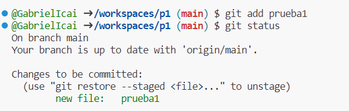
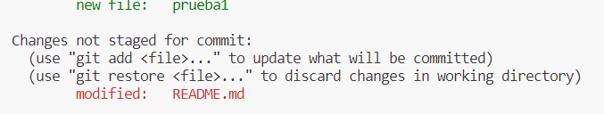
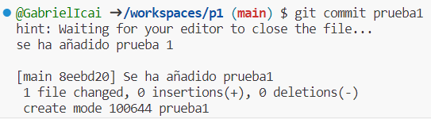
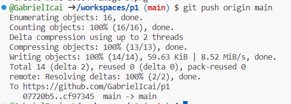
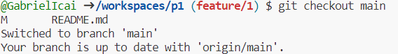
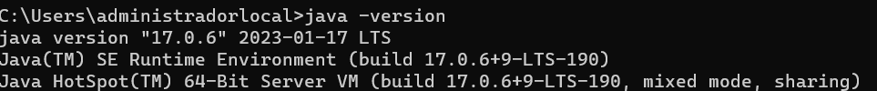
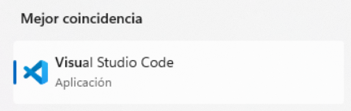
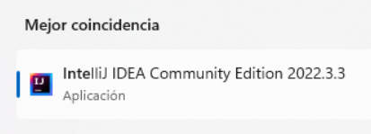
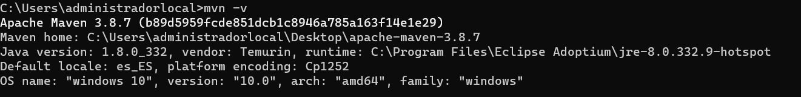

# Práctica 1

Este es el repositorio: https://github.com/GabrielIcai/p1 

## Comandos git básicos
Empezamos haciendo un git clone de p1 para tenerlo en local. Primero me muevo a tmp:

Ahora me voy a crear un fichero que se llame prueba1 y con git status podremos ver información como comprobar si han habido cambios, la rama en la que me encuentro etc. Pero antes es necesario utilizar un git add para añadir el fichero:

Ahora es necesario confirmar esos cambios. Como se puede observar en la imagen de debajo sigue habiendo cambios al escrcibir sobre el README que no estan confirmados:

Hacemos el git commit y describimos los cambios que hemos confirmado:

Ahora vamos a hacer el git push. Este comando nos permite subir los cambios de mi repositorio local al remoto:

Finalmente vamos a probar los comandos de checkout. En primer lugar el git checkout -b "name" crea una nueva rama con el nombre "name" y te mueve a ella.

!(image-5.png)

Por último el git checkout main cambia a la rama main pero como ya esta creada no utiliza la -b:

Como ya hemos terminado necesito hacer un commit de el README ya que estoy realiando la práctica aqui ademas de añadir todas las imagenes que he ido pegando y hacer un commit de ellas . 

Softwares Requeridos:

