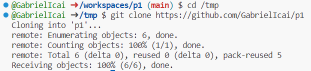

# Práctica 1

Este es el repositorio: https://github.com/GabrielIcai/p1 

## Comandos git básicos
Empezamos haciendo un git clone de p1 para tenerlo en local. Primero me muevo a tmp:



Ahora me voy a crear un fichero que se llame prueba1 y con git status podremos ver información como comprobar si han habido cambios, la rama en la que me encuentro etc. Pero antes es necesario utilizar un git add para añadir el fichero:


Ahora es necesario confirmar esos cambios. Como se puede observar en la imagen de debajo sigue habiendo cambios al escrcibir sobre el README que no estan confirmados:


Hacemos el git commit y describimos los cambios que hemos confirmado:


git status
git add .
git commit -m "TU MENSAJE"
git push

git checkout -b feature/1
git checkout main
```

## ¿Cómo escribir un README.md con formato?

[Github Markdown](https://docs.github.com/es/get-started/writing-on-github/getting-started-with-writing-and-formatting-on-github/basic-writing-and-formatting-syntax)
